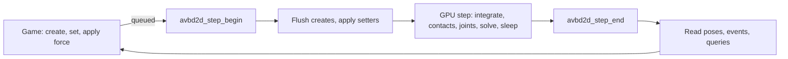

# avbd2d

> **Status: experimental.** It works for my use cases and has not been battle-tested.
> The API and behaviour may change.

A 2D rigid-body physics solver that runs on the GPU (Vulkan compute), using Augmented Vertex
Block Descent (AVBD). It has a C API shaped like Box2D v3. Version 1.0.0, C ABI 3.0.

Made for large worlds: 100,000 bodies step in about 4 ms (measured once on an RTX 4070 SUPER, see
[when to use it](docs/when-to-use.md)). For a few hundred bodies, Box2D on the CPU is likely the better choice.

## Install and build the demo

One command in **PowerShell**. It installs Git, CMake, Ninja, Python, the Vulkan SDK and the MSVC
Build Tools with `winget` (only the ones you are missing), clones the repo, builds the library and
the demo, and starts the demo. Needs a GPU with a Vulkan 1.3 driver. The first run downloads a few
GB, and Windows may ask for administrator approval once.

```powershell
$o='-e','--accept-package-agreements','--accept-source-agreements'; $i={param($id,[string[]]$x) winget list -e --id $id --accept-source-agreements >$null; if($LASTEXITCODE){winget install @o --id $id @x}}; & $i Git.Git; & $i Kitware.CMake; & $i Ninja-build.Ninja; & $i Python.Python.3.12; & $i KhronosGroup.VulkanSDK '--version','1.4.357.0'; & $i Microsoft.VisualStudio.2022.BuildTools '--override','--add Microsoft.VisualStudio.Workload.VCTools --includeRecommended --passive'; $env:Path=[Environment]::GetEnvironmentVariable('Path','Machine')+';'+[Environment]::GetEnvironmentVariable('Path','User'); $env:VULKAN_SDK=[Environment]::GetEnvironmentVariable('VULKAN_SDK','Machine'); git clone --recurse-submodules https://github.com/5weetdev/AVBD-2D-Physics-Engine-Vulkan.git; cd AVBD-2D-Physics-Engine-Vulkan; $vs=& "${env:ProgramFiles(x86)}\Microsoft Visual Studio\Installer\vswhere.exe" -latest -products * -property installationPath; cmd /c "call `"$vs\VC\Auxiliary\Build\vcvars64.bat`" && cmake -B build -S . -G Ninja -DCMAKE_BUILD_TYPE=Release && cmake --build build"; .\build\avbd2d_demo.exe
```

Nothing is prebuilt: the demo is `build\avbd2d_demo.exe` and the library is `build\avbd2d_solver.dll`.
Already have the tools, or something failed? See [requirements](docs/requirements.md) for the manual steps.

## How this was made

This project was built with heavy AI assistance (Claude). I directed the design, tested the
results by hand and fixed issues manually. The code has not had an independent expert review.

## Quickstart

Drop a box and read its pose:

```c
#include <stdio.h>
#include "avbd2d/avbd2d.h"

int main(void)
{
    Avbd2dWorld *world = NULL;
    avbd2d_create(&world);                                /* default def, gravity (0, -10) */

    Avbd2dBodyDef bd = avbd2d_default_body_def();
    bd.type = AVBD2D_DYNAMIC_BODY;
    bd.position = (Avbd2dVec2){0.0f, 5.0f};
    Avbd2dBodyId box;
    avbd2d_create_body(world, &bd, &box);

    Avbd2dShapeDef sd = avbd2d_default_shape_def();
    Avbd2dPolygon poly = avbd2d_make_box(0.5f, 0.5f);
    Avbd2dShapeId shape;
    avbd2d_create_polygon_shape(box, &sd, &poly, &shape);

    for (int i = 0; i < 60; ++i)
        avbd2d_step(world);                               /* creations flush at the first step */

    Avbd2dVec2 p;
    avbd2d_body_get_position(box, &p);                    /* the body origin */
    printf("origin after 1 s: (%.3f, %.3f)\n", p.x, p.y);

    avbd2d_destroy(world);
    return 0;
}
```

## How a step works

Writes made by the game are queued. The step applies them, runs on the GPU, and the results
are read back once the step ends.



- Creating and destroying are live. Nothing is rebuilt.
- Forces and torques act for the next step only. Impulses change velocity before it.
- Between `avbd2d_step_begin` and `avbd2d_step_end`, getters and setters are allowed. They read
  the previous state and queue for the next step.
- Positions are body origins. `avbd2d_body_get_world_center` returns the centre of mass.
- Every call returns `Avbd2dResult`. A stale or null id returns an error code; it does not crash.

## Features

Implemented in the code. Only the demo scenes and `avbd2d_demo --smoke` exercise them; there are no automated tests.

| Area | What you get |
| :--- | :--- |
| World | Gravity, time step, iterations, penalty ramp, sleep and kill-plane settings, host-owned Vulkan device (`avbd2d_create_with_vulkan`), memory budget |
| Bodies | Static, kinematic and dynamic; forces, impulses, velocities, damping, `fixedRotation`, locked axes, bullets, enable and disable |
| Shapes | Polygon (up to 8 vertices, optional rounding), circle, capsule, two-sided segment, one-sided chain; several shapes per body, added and removed live |
| Joints | Revolute, weld, prismatic, wheel, distance, motor, filter; limits, motors, springs |
| Other | Explosions, mouse grab, continuous collision against static geometry, sleep, filtering, user data pointers on bodies, shapes and joints |
| Ids | Generational ids with `*_is_valid`; stale ids are rejected, not reused silently |

## Limitations

| Limitation | Effect | Source |
| :--- | :--- | :--- |
| No restitution: `restitution` is stored and has no effect | No bouncing | `capabilities.restitution = 0` |
| Joint damping ratios are accepted and ignored | Springs and welds oscillate more than in Box2D | `capabilities.joint_damping_ratio = 1` |
| No determinism | Not bit-exact across runs, drivers or hardware; no lockstep or rollback | `capabilities.determinism = 0` |
| Per-body `enableSleep` is ignored; explosion `maskBits` is not applied | Sleep is velocity-gated; explosions are not filtered by category | `capabilities.per_body_sleep_disable`, header |
| No render-target interop | `avbd2d_register_render_target` returns `AVBD2D_ERR_UNSUPPORTED` | header |
| Fixed cost of about 0.5 ms per step | A few hundred bodies is faster on the CPU; large worlds are where the GPU pays off (100k bodies step in about 4 ms) | measured once, see [when to use it](docs/when-to-use.md) |
| Tested on one machine | Other GPUs, drivers and operating systems are untested | - |
| Vulkan 1.3 | Needs int64, buffer device address, 64-bit atomics, scalar layout, synchronization2 | `avbd2d.h`, build |

Full list and the reasoning: [limitations](docs/limitations.md).

## Tests

There are no automated tests and no benchmarks in this repository. The only check is
`avbd2d_demo --smoke`, which steps all demo scenes with the validation layer on and fails on a
step failure, a non-finite value or a validation message. It shows the scenes run; it does not
prove the physics is correct. The timing figures in the docs were measured by hand on one machine.

## Documentation

| Page | Read it for |
| :--- | :--- |
| [Getting started](docs/getting-started.md) | Build, run the demo, the quick-start line by line |
| [Concepts](docs/concepts.md) | Units, ids, deferred writes, the async step |
| [API cheatsheet](docs/api-cheatsheet.md) | Calls grouped by task |
| [Box2D port](docs/box2d-port.md) | `b2*` to `avbd2d_*`, and what is not supported |
| [Limitations](docs/limitations.md) | The full list above, with detail |
| [When to use it](docs/when-to-use.md) | CPU or GPU, and the step-cost table |
| [Architecture](docs/architecture.md) | The step pipeline and the solver layout |
| [Requirements](docs/requirements.md) | What to install, then build and run the demo |
| [Troubleshooting](docs/troubleshooting.md) | `ERR_DEVICE`, `ERR_CAPACITY`, `DEVICE_LOST`, a black demo, a missing SDL2.dll |

The public header is [include/avbd2d/avbd2d.h](include/avbd2d/avbd2d.h). It is the contract.

## Maintenance

Low-effort, best-effort support. I may continue the project if I want to; issues and pull
requests may not get a quick answer, or an answer at all. No guarantees. AI-assisted pull requests
are accepted if you disclose it ([CONTRIBUTING](CONTRIBUTING.md)).

## License

MIT, see [LICENSE](LICENSE). Provided "as is", without warranty of any kind. Parts derive from
other projects; see [THIRD_PARTY_NOTICES](THIRD_PARTY_NOTICES.md).

## Credits

- **AVBD method and demo code:** Chris Giles, Elie Diaz and Cem Yuksel, "Augmented Vertex Block
  Descent", SIGGRAPH 2025. Parts of the Vulkan layer derive from Chris Giles's AVBD demo code.
- **Box2D:** the contact-manifold code is a port of Box2D v3 (Erin Catto, MIT). The API is shaped
  after Box2D v3.
- **Demo only:** SDL2 (zlib), Dear ImGui (MIT).
