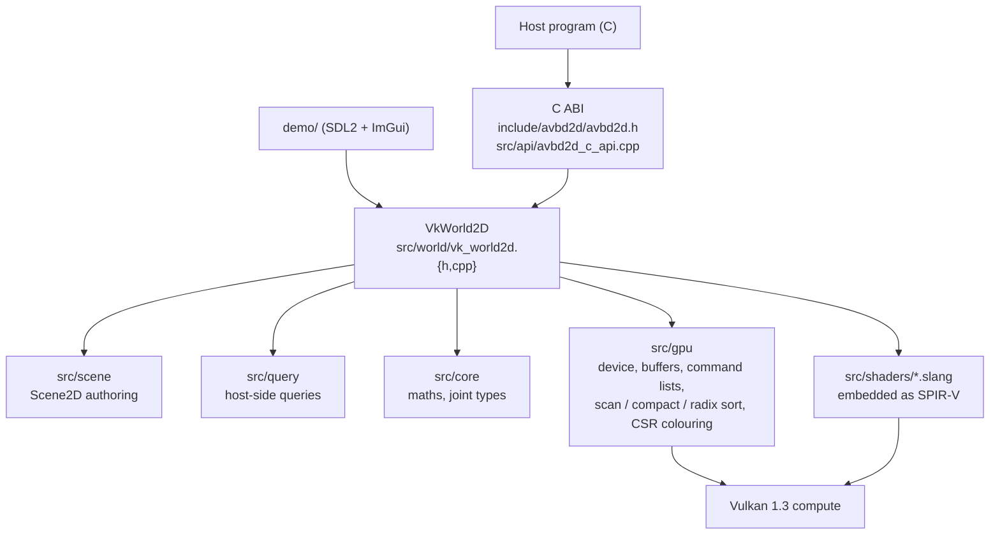

# avbd2d architecture

`avbd2d` is a 2D AVBD rigid-body solver on Vulkan compute. Bodies have three degrees of freedom
(`x`, `y`, `theta`). The solver is exposed through a C ABI shaped like Box2D v3's. The GPU path is
the only path. It has been tested on one machine only.

This document is for a new contributor: where things live, what one step does, and the rules the
capacity, async and shader code must keep.

## Layers

Dependencies point downward. The ABI and the demo use `VkWorld2D`; nothing below `src/world`
includes the ABI. The shared Vulkan layer in `src/gpu` knows nothing about 2D bodies.

## File map

| Path | What it holds |
| :--- | :--- |
| `include/avbd2d/avbd2d.h` | The public C ABI, version 3.0 (`AVBD2D_ABI_VERSION_MAJOR/MINOR`). Defs, ids, error codes, stats, capabilities. |
| `src/api/avbd2d_c_api.cpp` | ABI implementation over `VkWorld2D`. Turns queued calls into step input, settles an in-flight step before reads, maps errors. |
| `src/world/vk_world2d.{h,cpp}` | `VkWorld2D`: device buffers, pipelines, the step, reruns, the mutation queue, live create/destroy, read-backs. |
| `src/world/world2d_args.h` | Host mirror of `src/shaders/types2d.slang` (`World2Gpu`, `DispatchArgs2Gpu`, `BuildArgs2Gpu`, ...). Change both together; `static_assert`s pin the sizes. |
| `src/core/maths2d.h`, `joint2d.h` | Vector maths, the `Shape2D` enum, joint types. |
| `src/scene/scene2d.h` | `Scene2D`: authored bodies, shapes, joints, no-collide pairs. |
| `demo/scenes2d.h`, `scenes2d_box2d.h` | The built-in scene catalogue (pyramids, piles, ragdolls, shapes, chains). |
| `demo/scene_io2d.h` | The `.a2dcap` scene capture format (magic and version; a new `Scene2D` array must be added to `visitScene2D`). |
| `src/query/query2d.{h,cpp}` | Host-side ray, overlap and shape-cast queries. |
| `src/shaders/*.slang` | 2D kernels: `integrate2d`, `broadphase2d`, `narrowphase2d`, `solver2d`, `sleep2d`, `events2d`, `ccd2d`, `constraints2d`, `query2d`. `collide2d`, `distance2d`, `maths2d`, `types2d` are shared modules imported by these. |
| `src/gpu/*.{h,cpp}` | The shared Vulkan layer: `vk_device` (instance, device, features), `vk_buffer`, `vk_pipeline`, `vk_cmd` (command list and barriers), `vk_primitives` (scan, compact, radix sort), `vk_constraints` (CSR graph and Jones-Plassmann colouring), `vk_gate` (indirect dispatch gate). |
| `src/gpu/shaders/*.slang` | Shared kernels: `scan`, `compact`, `radix`, `constraints`. |
| `demo/main2d.cpp`, `renderer2d.{h,cpp}`, `shaders/scene2d.slang` | `avbd2d_demo`: SDL2 + ImGui front end and a flat-colour instanced renderer. |
| `tools/embed_spirv.py` | Turns a `.spv` file into a C++ header holding the words. |
| `CMakeLists.txt` | Targets: `avbd2d_gpu`, `avbd2d_vk`, `avbd2d_solver` (shared library), `avbd2d_demo`. |

## One step

`VkWorld2D::step()` is `stepBegin()` followed by `stepEnd()`. `stepBegin` records the whole pass
and submits it once. The order below is the order of the recorded dispatches.

1. **Queued edits.** Live creations, the mutation queue (pose, velocity, impulses, wake, sleep,
   enable/disable, joint patches) and explosion impulses are applied on the device. Only the first
   pass applies them; a rerun restores state after them. A pending wake-all lands before the state
   copy.
2. **State copy.** Dynamic body and joint state is copied at the top of the step, so a rerun can
   restore it.
3. **Joint init, then integrate.** A hard joint measures its error `C0` at the pre-step pose `x^t`.
   Measuring it at the warm-started pose would cancel the error the joint exists to correct.
4. **Broadphase.** Grid clear and insert, pair emission, oversize-body pairs, then a radix sort of the
   pair keys (a one-workgroup sort for small worlds).
5. **Narrowphase.** Manifolds are built from the `x^t` positions with the warm-started angles, and
   the margin is widened by the pair's relative sweep. Persistent contact cache (warm start) is
   kept. Then wake, from contacts and joints touching awake bodies.
6. **Constraint graph and colouring.** CSR graph, then Jones-Plassmann colouring. A small world
   builds this in one workgroup.
7. **Iterations.** Per iteration: a primal sweep for each colour (Gauss-Seidel over colours), then
   the contact dual and the joint dual. A small world runs the whole loop in one workgroup
   (`csIterate2D`); the arithmetic is the same.
8. **Events.** Contact begin/end, sensor begin/end, hit and joint-break records are appended on
   the device.
9. **Velocity and guard.** Velocities are computed (BDF1). The guard removes bodies that fall below
   the kill plane, are non-finite, out of range or too fast.
10. **Continuous collision.** Only when `enableContinuous` is set and dynamic bodies exist. Fast
    bodies are flagged, compacted and swept with indirect dispatches. This is a pose clamp after the
    solve; the solve itself is unchanged. Non-bullets are swept against statics first; bullets also
    see the dynamic bodies at their final poses.
11. **Sleep.** Prepare, mark candidates, propagate over contacts and joints, commit.
12. **Read-backs,** in the same submission: the compacted moved-body list, status and counters, events,
    CCD stats, and full pose arrays unless `setFullReadback(false)`.

Three of these look wrong on a first read and are deliberate:

- **Joint init before integrate** (step 3). See above.
- **Contacts are searched along the sweep** (step 4). The broadphase reports a pair when two `x^t`
  boxes overlap anywhere along their relative motion. Testing only the end pose let fast bodies
  tunnel through the pile.
- **The grab target moves at most `grabMaxSpeed * dt` per step** (default 20 m/s). A jump straight
  to the cursor flung held bodies at hundreds of m/s.

## Rerun and capacity contract

The step runs with buffers that were sized on the host before recording. A count-producing phase
counts what it needs on the device and guards its writes. If a pair buffer, the contact buffer, the
Jones-Plassmann round bound or the colour bound was too small:

1. the pass is discarded;
2. dynamic body and joint state is restored from the copy taken at the top of the step;
3. the resource grows (`cappedGrow`: need plus 25% plus slack, clamped to a ceiling); contact
   warm-start state survives growth;
4. the step is recorded and submitted again.

`StepResult2D` and the ABI stats count the reruns (`capacityReruns`, `jpReruns`, `colorReruns`,
`submits`). A normal step submits once.

**Ceilings.** The pair ceiling is `max(65536, 12 * bodies)`, capped at 16 million. The contact buffer
is sized from the pair count (at least two contacts per new pair) up to its own ceiling. These exist
so a diverged simulation cannot ask the driver for gigabytes. When a ceiling clamps a result,
`StepResult2D::ok` is false and the ABI returns `AVBD2D_ERR_CAPACITY`; the step still ran.

**Events never rerun.** An event kind that overflows keeps its first records, sets bit `k` in
`eventsTruncated`, and its buffer grows for the next step.

**Memory budget.** `avbd2d_set_memory_budget` caps device allocation. Growth that would exceed it is
refused with `AVBD2D_ERR_CAPACITY`, and the step clamps as at a ceiling.

**Errors, not aborts.** The ABI returns `AVBD2D_ERR_DEVICE`, `AVBD2D_ERR_OUT_OF_MEMORY` or
`AVBD2D_ERR_DEVICE_LOST`. After device loss the world is dead; destroy it and create a new one.

## Async contract

`stepBegin()` submits and returns. `stepEnd()` waits, reruns if needed, and commits the result to the
host mirrors. The ABI exposes the same halves as `avbd2d_step_begin` and `avbd2d_step_end`;
`avbd2d_step` is both.

Between begin and end (C++ `stepInFlight()` is true):

- getters return the previous step's host mirror;
- `queue*` calls and `spawn` / live edits are allowed and apply at the next step;
- the C++ API expects nothing else to be called.

The ABI enforces this. `avbd2d_step_begin` first settles any step already in flight. Queries, explosions
and the grab calls settle the in-flight step before they read state. A failure from a settled step is
held and returned by the next `avbd2d_step_end`. `avbd2d_step_end` with no step in flight returns
`AVBD2D_OK` and changes nothing. `stepBegin` while a step is in flight is a no-op.

## Shaders and embedding

Kernels are written in Slang and compiled to SPIR-V at build time. Nothing is loaded from disk at run time.

- `slangc` is found through `VULKAN_SDK` (the CMake hints also check a fixed SDK path).
- Each module in `src/shaders` and `src/gpu/shaders` is compiled with
  `-target spirv -profile spirv_1_5 -fvk-use-scalar-layout -fvk-use-entrypoint-name -emit-spirv-directly -O2`.
- `tools/embed_spirv.py` writes `<build>/shaders2d_gen/<name>_spirv.h` (or `shaders_gpu_gen/`), which
  defines `<name>_spirv[]` and `<name>_spirv_words`. The `.cpp` files include these headers.
- `slangc` writes no dependency file, so every SPIR-V in a directory depends on every `.slang` in
  that directory. Editing a shared module rebuilds all its importers.
- The host structs in `world2d_args.h` must match `types2d.slang` field for field. Change both in one
  edit; the `static_assert`s catch a size change but not a reordering.
- Two parts of the Vulkan layer are tested with environment hooks: `AVBD_VK_VALIDATION=1` turns on the
  validation layer, and `AVBD_VK_PIN_SUBGROUP` forces a subgroup size.

## Not in v1

- Restitution: accepted and stored, no effect (`capabilities` reports it).
- Joint `dampingRatio`: accepted and ignored.
- Explosion `maskBits`: accepted, not applied.
- Render-target interop: `avbd2d_register_render_target` returns `AVBD2D_ERR_UNSUPPORTED`.
- Islands, LOD, shadows and ambient occlusion.

