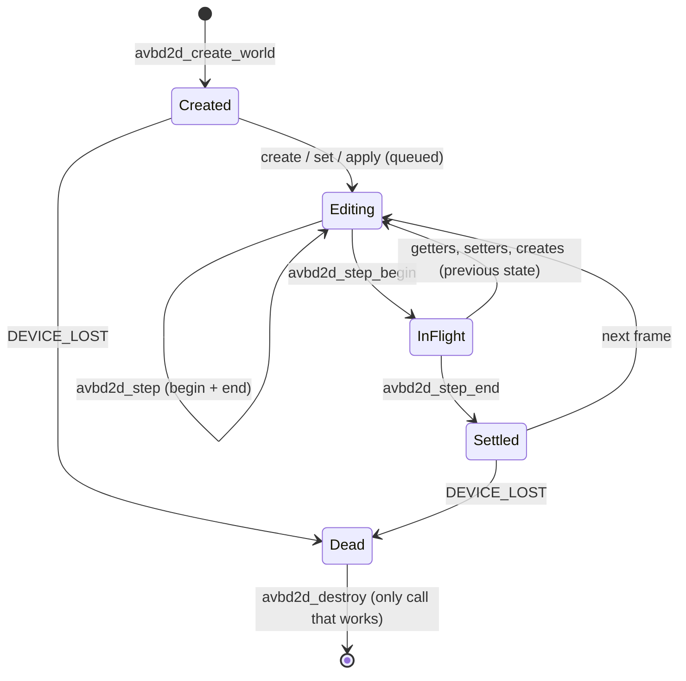

# avbd2d concepts

The mental model behind the C ABI in `include/avbd2d/avbd2d.h`.

## Units and coordinates

| Quantity | Unit |
|---|---|
| Length | metre |
| Time | second (`timeStep` default 1/60) |
| Angle | radian |
| Force | newton (`breakForce` is N on the linear rows) |
| Torque | N·m |
| Impulse | N·s (a force applied for `dt` becomes an impulse of `force * dt`) |
| Gravity | m/s², default `(0, -10)` |

- Axes: **x right, y up**. Angles are counter-clockwise positive.
- Polygon vertices are **counter-clockwise**; normals point outward.
- A chain's solid side is on the **right** of each `p[i] -> p[i+1]`.
- Positions are **body origins**. The solver integrates the centre of mass, so use
  `avbd2d_body_get_world_center` when you need it.

## Generational ids

Every object (body, shape, joint, chain) has an id struct:

```c
typedef struct Avbd2dBodyId { int32_t index1; uint16_t world0; uint16_t generation; } Avbd2dBodyId;
```

- `index1` is slot + 1, so `0` is the null id.
- `generation` counts the slot's reuses. A destroyed id stops matching its slot.
- Check with `avbd2d_body_is_valid`, `avbd2d_shape_is_valid`, `avbd2d_joint_is_valid`, `avbd2d_chain_is_valid`.

A stale or never-issued id returns `AVBD2D_ERR_INVALID_ARG`. It never crashes.

## Def structs and default fillers

Every `*Def` struct has a matching filler. Fill it, then override fields:

```c
Avbd2dBodyDef bd = avbd2d_default_body_def();
bd.type = AVBD2D_DYNAMIC_BODY;
bd.position = (Avbd2dVec2){0.0f, 5.0f};
```

Fillers exist for: world, body, shape, chain, each joint type, explosion, query filter.
Geometry and result structs (`Avbd2dVec2`, `Avbd2dPolygon`, `Avbd2dRayResult`, ...) have no filler.

## Queued work

| Call kind | When it takes effect |
|---|---|
| `create_body`, `create_*_shape`, `create_chain`, `create_*_joint` | The id is valid at once. The object enters the sim at the **next step**. |
| `destroy_body`, `destroy_shape`, `destroy_chain` | Immediate: the id becomes invalid. |
| `destroy_joint` | The joint stops acting at the **next step**. |
| All `set_*` and `apply_*` setters | Applied at the **top of the next step**. |
| Forces and torques | Act for the **next step only**. |
| Impulses | Change velocity **before** the next step. |
| `world_explode`, `grab_*` | Applied at the next step; they settle a step in flight first. |

Getters read the **last completed step**, plus whatever was queued since, for pose and velocity.

## Stepping

```c
avbd2d_step(world);            /* same as the two calls below */

avbd2d_step_begin(world);      /* submits the whole step to the GPU, returns */
/* ... getters, setters, creates, destroys are fine here ... */
avbd2d_step_end(world);        /* waits; events and stats are now valid */
```

- `avbd2d_step_end` with no step in flight returns `AVBD2D_OK` and changes nothing.
- Queries, explosions and grab **settle the step in flight first** (except batched queries, which answer from the last finished pose).
- Calls on one world must not overlap. Different worlds are independent.



## Events

- Four lists: body moves, contact begin/end/hit, sensor begin/end, joint breaks.
- Readback is **moved-only**: `fellAsleep` bodies and bodies awake during the step are reported; a resting world returns none.
- Each list is valid **until the next `avbd2d_step_end`** (or `avbd2d_step`). Copy what you need before then.
- A shape that was re-added to a live body may report an END and a BEGIN in the same step.

## Error codes

| Code | Meaning |
|---|---|
| `AVBD2D_OK` | Success. |
| `AVBD2D_ERR_NULL_HANDLE` | Null, never-created, or destroyed world handle. |
| `AVBD2D_ERR_INVALID_ARG` | Null pointer, bad value, or stale/invalid id. |
| `AVBD2D_ERR_UNSUPPORTED` | Outside the 2D solver (render-target interop). |
| `AVBD2D_ERR_NOT_COMMITTED` | Unused since ABI 3. |
| `AVBD2D_ERR_DEVICE` | No usable Vulkan device, or the device lacks a required feature. |
| `AVBD2D_ERR_CAPACITY` | A hard ceiling or the memory budget clamped the step. The step still ran. |
| `AVBD2D_ERR_DEVICE_LOST` | Device failed. The world is dead: only `avbd2d_destroy` works. Create a new world. |
| `AVBD2D_ERR_OUT_OF_MEMORY` | Host or device memory ran out, or the budget forbade a required allocation. |

`avbd2d_result_string(r)` returns a readable name.

Treat `ERR_CAPACITY` as a warning and check `avbd2d_get_stats` (`ok == 0`). Treat `DEVICE_LOST` as fatal for that world.

## Memory budget

- `Avbd2dWorldDef.memoryBudget` or `avbd2d_set_memory_budget(world, bytes)` caps device memory. `0` means unlimited.
- The budget may be changed at any time.
- Growth beyond it is refused: the step clamps and returns `AVBD2D_ERR_CAPACITY`, or `AVBD2D_ERR_OUT_OF_MEMORY` if a required allocation is forbidden.
- `bodyCapacity`, `shapeCapacity`, `jointCapacity` are **hints only**. The world grows regardless.
- Device buffers grow but never shrink, so a world's peak usage is its footprint, even after objects are destroyed.
