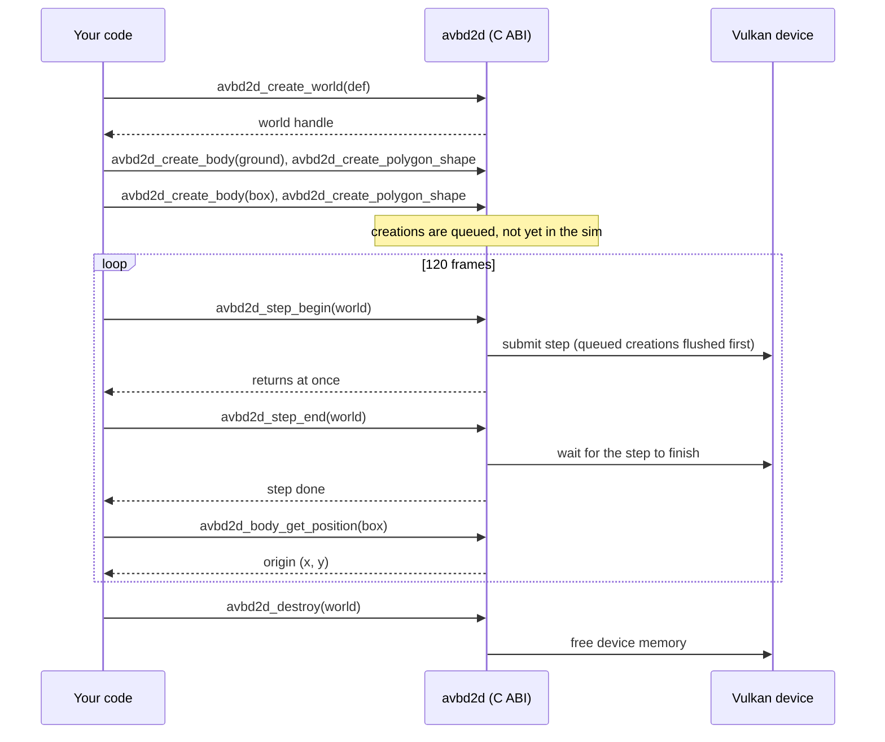

# Getting started with avbd2d

Drop a box onto the ground in about 60 lines of C. This page gets you from a clean checkout to a
running program. The API is shaped like Box2D v3, so if you know Box2D the calls will feel familiar.

## Prerequisites

| Need | Version / notes |
|------|-----------------|
| GPU and driver | Any Vulkan 1.3 capable device |
| Vulkan SDK | Provides the loader and `slangc.exe` (in its `Bin` folder) |
| Python | Used to embed the SPIR-V kernels at build time |
| CMake | 3.20 or newer |
| MSVC | Visual Studio 2022 with the C++ tools (run the steps from an x64 Native Tools Command Prompt; install steps in [requirements](requirements.md)) |

## Build in 3 commands

From the repository root:

```bat
cmake -B build -S . -G Ninja -DCMAKE_BUILD_TYPE=Release
cmake --build build --target avbd2d_solver
cl /I include\avbd2d /DAVBD2D_USE_SHARED examples\hello.c build\avbd2d_solver.lib /Fe:hello.exe
```

The first two commands build the shared library `avbd2d_solver.dll`. The third compiles
`examples\hello.c` against the public header and links the import library `avbd2d_solver.lib`.
Define `AVBD2D_USE_SHARED` so the header declares the functions as imports.

To run it, put the DLL next to the executable and start it:

```bat
copy build\avbd2d_solver.dll .
hello.exe
```

## Link against avbd2d in your own project

You need three things:

- the include directory `include/avbd2d`, which holds `avbd2d.h`
- the import library `avbd2d_solver.lib`, from the build output
- the `AVBD2D_USE_SHARED` define

If your project uses CMake, link the `avbd2d_solver` target and the define comes with it.
Ship `avbd2d_solver.dll` next to your executable.

## The walkthrough

The full program is in [`examples/hello.c`](../examples/hello.c). Here it is in pieces.

### 1. Include the header and check results

```c
#include "avbd2d.h"

#define CHECK(call) /* stops with a message unless the call returns AVBD2D_OK */
```

The header is the only dependency. Every call returns an `Avbd2dResult`. The `CHECK` macro in
`hello.c` prints the failing call and `avbd2d_result_string` text, then exits.

### 2. Create a world

```c
Avbd2dWorldDef worldDef = avbd2d_default_world_def();
worldDef.gravity = (Avbd2dVec2){0.0f, -10.0f};
worldDef.timeStep = 1.0f / 60.0f;

Avbd2dWorld *world = NULL;
CHECK(avbd2d_create_world(&worldDef, &world));
```

Every struct has a default filler named `avbd2d_default_*`. Start from it, then override the fields you need.

### 3. Add a static ground

```c
Avbd2dBodyDef groundDef = avbd2d_default_body_def(); /* static by default */
groundDef.position = (Avbd2dVec2){0.0f, 0.0f};

Avbd2dBodyId ground;
CHECK(avbd2d_create_body(world, &groundDef, &ground));

Avbd2dShapeDef shapeDef = avbd2d_default_shape_def();
Avbd2dPolygon groundBox = avbd2d_make_box(20.0f, 1.0f);

Avbd2dShapeId groundShape;
CHECK(avbd2d_create_polygon_shape(ground, &shapeDef, &groundBox, &groundShape));
```

A body is created first, then its shape is attached. `avbd2d_make_box` takes half-extents, so this
ground is 40 m wide and its top face sits at `y = 1`.

### 4. Add a dynamic box

```c
Avbd2dBodyDef boxDef = avbd2d_default_body_def();
boxDef.type = AVBD2D_DYNAMIC_BODY;
boxDef.position = (Avbd2dVec2){0.0f, 10.0f};

Avbd2dBodyId box;
CHECK(avbd2d_create_body(world, &boxDef, &box));

Avbd2dPolygon boxShape = avbd2d_make_box(0.5f, 0.5f);

Avbd2dShapeId boxShapeId;
CHECK(avbd2d_create_polygon_shape(box, &shapeDef, &boxShape, &boxShapeId));
```

The box starts 10 m up. Its shape uses the same `shapeDef` as the ground.

### 5. Step and read the pose

```c
for (int frame = 1; frame <= 120; ++frame) {
    CHECK(avbd2d_step(world));

    if (frame % 20 == 0) {
        Avbd2dVec2 p;
        CHECK(avbd2d_body_get_position(box, &p));
        printf("frame %3d  y = %.3f\n", frame, p.y);
    }
}
```

`avbd2d_step` advances the world by one `timeStep`. `avbd2d_body_get_position` returns the body
origin, the same point Box2D's `b2Body_GetPosition` returns. The box should fall and settle near
`y = 1.5`, which is the top of the ground plus the box's half-height.

### 6. Destroy the world

```c
CHECK(avbd2d_destroy(world));
```

Destroying the world frees its bodies, shapes and joints. You do not need to destroy them one by one.

## What happens under the hood

`avbd2d_step` is shorthand for `avbd2d_step_begin` followed by `avbd2d_step_end`. The split lets you
do host work while the GPU runs the step. The sequence for `hello.c`:



Between `step_begin` and `step_end` you may call getters, setters and creates. They read the last
finished step and queue their changes for the next one.

## Next steps

- [Concepts](concepts.md): bodies, shapes, ids, and when changes take effect
- [API cheatsheet](api-cheatsheet.md): every function on one page
- [Box2D port notes](box2d-port.md): how the names and call order map from Box2D v3
