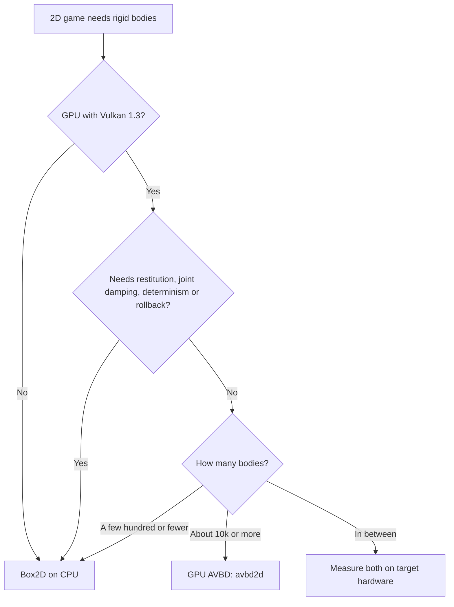

# When to use avbd2d

**What you get:** a quick way to decide whether avbd2d (GPU) or Box2D (CPU) fits your game.

## Decision table

| Your game | Use avbd2d? | Why |
| :--- | :--- | :--- |
| Destruction, debris, particle-like rubble | **Yes** | The GPU wins from roughly 10k bodies up (100k bodies step in about 4 ms) |
| Huge piles, sandbox games with many dynamic objects | **Yes** | Same reason; the fixed step cost is amortised |
| Typical 2D game with a few hundred bodies | **No** | The fixed GPU step cost (about 0.5 ms) is more than Box2D needs on one CPU core |
| Between a few hundred and about 10k bodies | **Measure first** | No measured break-even in v1; time both on your target machine |
| Bouncing, restitution-driven gameplay | **No** | Restitution has no effect |
| Joint-heavy rigs that need joint damping | **No** | `dampingRatio` is ignored |
| Lockstep or rollback netcode | **No** | Not deterministic |
| Large world on a GPU with Vulkan 1.3 | **Yes** | This is the tested niche |

## Decision flow

### GPU AVBD vs Box2D on CPU

## Cost figures

Measured on an RTX 4070 SUPER, 2026-10-06, default 8 iterations, sleep off:

| Scene | Bodies | Host step (ms) |
| :--- | ---: | ---: |
| Pyramid | 211 | 1.11 |
| Ragdolls | 333 | 1.48 |
| Pile | 10,003 | 1.63 |
| Pile | 100,003 | 4.25 |

The step cost barely grows from a few hundred to 10k bodies, so small worlds pay almost the same as large ones.
